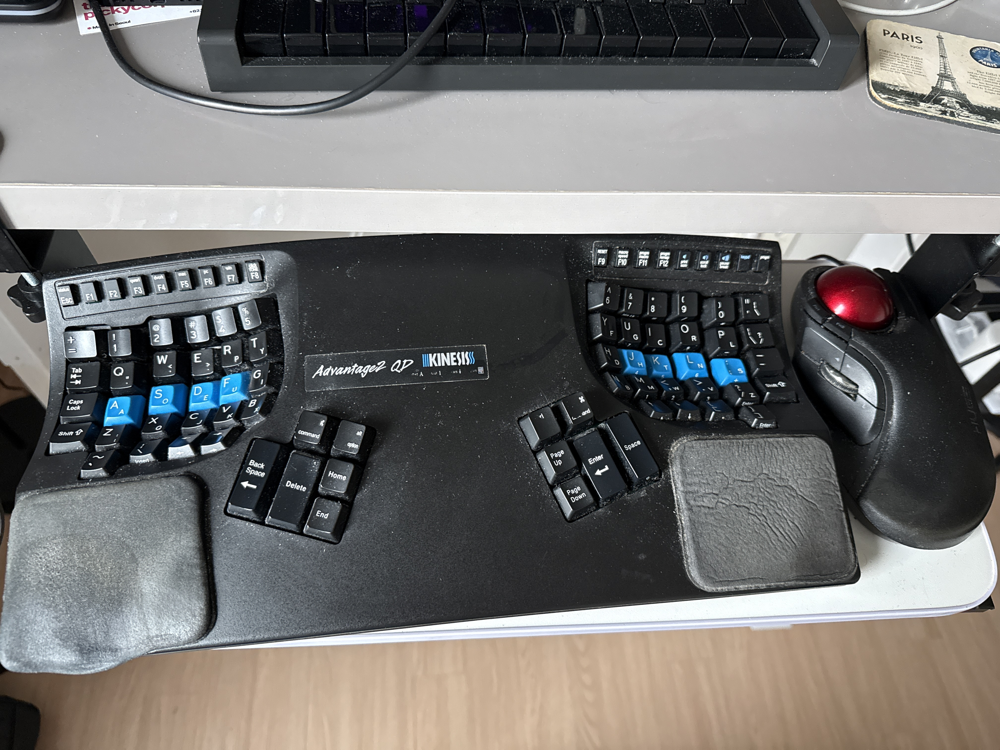
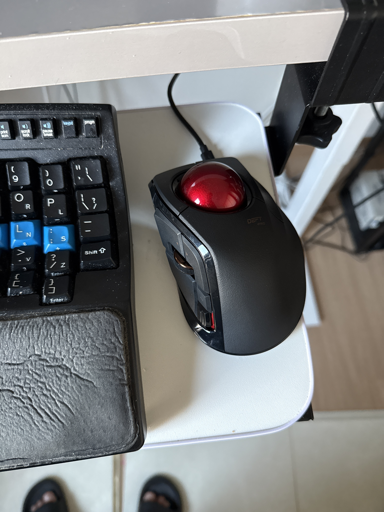

I recently picked up a new trackball to replace my prematurely aging Elecom HUGE.
Here are my first impressions after only a few hours, since there wasn't much I could find online comparing them properly.

# Why I use a Trackball

To get the obvious question out of the way first,
I have used a trackball for about 5 years as my primary pointer device.
I switched from all manner of mice and trackpads due to ergonomics.
I had pretty bad RSI for many years, due to excessive computer use,
and a trackball was one of the key changes that solved my issues.

The trackball actually had a larger impact than switching to Dvorak (minimal improvement)
or switching to a better ergonomic keyboard (Kinesis Advantage 2 QD; incremental, but not order of magnitude improvement).
And yes, I'm aware of vertical mice.
I tried a Logitech one for about 2 years and it actually made things worse.

# Size

The biggest difference is probably the size.
The Deft Pro has a much smaller footprint than the HUGE.
Part of the reason for this early replacement is that I ordered a replacement keyboard drawer online the other week.
Being too lazy to measure, and just going off the scale photos, it looked *plenty* big.

Narrator: it was, in fact, far too small and barely fits the keyboard.

So, with the HUGE practically falling off,
combined with my bad habit of snacking and drinking at my desk late at night contributing to click malfunction
(weirdly it would DOUBLE register clicks!), I needed a replacement.

The Deft Pro is pretty much the size I wanted.
It fits (just barely) on my tiny keyboard tray,
and it is quite comfortable to use.

# Weight/grip

I have to say I wish this thing were a bit heavier.
I want the thing to sit on my desk like a rock and not move.
I tend to manipulate the ball with my fingertips,
and keep other fingers on the buttons, but this tends to push the base off to the left.
Maybe I'll look at a sticky setup or something...

# Control positions

I do not use extra buttons.
I will not install your proprietary software.
So, I only use the left+right click
and the forward/back buttons (which are a plug-and-play compatible standard
that's recognized by my web browser and many dev tools like JetBrains IDEs).

I think the HUGE positioning was a bit better for the forward/back buttons.
The scroll and left click position are fine for my usage style.
The right click though... That will take some getting used to.
I think they designed the Deft to be held in your hand pretty closely,
but that isn't how I got used to using the HUGE.

I'll give this a shot and see how it goes after a few weeks trying a different grip.
I think right click is positioned fine for the intended style of gripping.

# Scroll wheel

The Deft allows for much better precision, with each step being a nice crisp click.
I personally liked the HUGE better.
It was pretty fluid, smooth, and not "clicky."
It also could generate acceptable scrolling speeds.
Not as good as an Apple trackpad, but acceptable.
I had to jack up the scroll speed to max for the Deft,
and will probably continue using my trackpad for gestures like this when I want to go fast.

This is not a criticism of Elecom specifically; it's a universal gripe I have with most things
_except_ the Apple trackpad.

# The ball

The ball itself is great!
I found some reviews online complaining that it was sticky,
or hard to manipulate precisely.
I have not had any issues so far; it feels as good or better than the HUGE.

# Connectivity

If I recall, the HUGE required you to select a connectivity option at purchase time.
The Deft Pro includes all in the same package: bluetooth, RF via USB wireless dongle, and cabled USB connection.
This is great if you like to travel with an external input device!

I personally don't since I love my MacBook trackpad.
But if you do, the only thing I'd flag is that there is no internal battery.
You need a single AA battery rather than an internal rechargeable like the higher end Logitech mice.

# Overall impressions

It lives up to the name: it's Deft.
I like a few things about the HUGE better (the scroll wheel and right mouse button position being the main ones),
but I _did_ buy this for a smaller footprint,
and I think I can get used to the button position with a tighter grip.

I'll post a follow up later once I have a chance to use it more.
