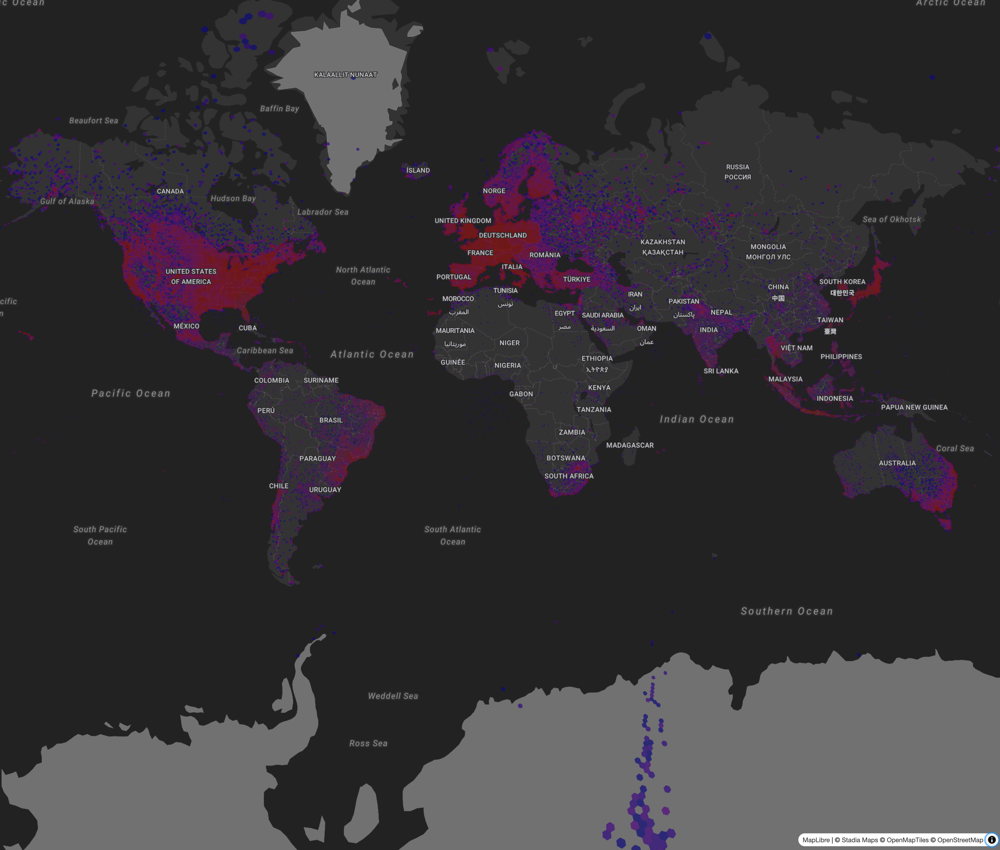

My day job involves wrangling a lot of data very fast.
I've heard a lot of people raving about several technologies like DuckDB,
(Geo)Parquet, and Apache Arrow recently.
But despite being an "early adopter,"
it took me quite a while to figure out how and why to leverage these practiclaly.

Last week, a few things "clicked" for me, so I'd like to share what I learned in case it helps you.

# (Geo)Parquet

(Geo)Parquet is quite possibly the best understood tech in the mix.
It is not exactly new.
Parquet has been around for quite a while in the big data ecosystem.
If you need a refresher, the [Cloud-optimized Geospatial Formats Guide](https://guide.cloudnativegeo.org/geoparquet/)
gives a great high-level overview.

Here are the stand-out features:

* It has a schema and some data types, unlike CSV (you can even have maps and lists!).
* On disk, values are written in groups per _column_, rather than writing one row at a time.
  This makes the data much easier to compress, and lets readers easily skip over data they don't need.
* Statistics at several levels which enable "predicate pushdown." Even though the files are columnar in nature,
  you can narrow which files and "row groups" within each file have the data you need!

Practically speaking, parquet lets you can distribute large datasets in _one or more_ files
which will be significantly _smaller and faster to query_ than other familiar formats.

## Why you should care

The value proposition is clear for big data processing.
If you're trying to get a record of all traffic accidents in California,
or find the hottest restaurants in Paris based on a multi-terabyte dataset,
parquet provides clear advantages.
You can skip row groups within the parquet file or even whole files
to narrow your search!
And since datasets can be split across files,
you can keep adding to the dataset over time, parallelize queries,
and other nice things.

But what if you're not doing these high-level analytical things?
Why not just use a more straightforward format like CSV
that avoids the need to "rotate" back into rows
for non-aggregation use cases?
Here are a few reasons to like Parquet:

* You actually have a schema! This means less format shifting and validation in your code.
* Operating on row groups turns out to be pretty efficient, even when you're reading the whole dataset.
  Combining batch reads with compression, your processing code will usually get faster.
* It's designed to be readable from object storage.
  This means you can often process massive datasets from your laptop.
  Parquet readers are smart and can skip over data you don't need.
  You can't do this with CSV.

The upshot of all this is that it generally gets both _easier_ and _faster_
to work with your data...
provided that you have the right tools to leverage it.

# DuckDB

DuckDB describes itself as an in-process, portable, feature-rich, and fast database
for analytical workloads.
DuckDB was that tool that triggered my "lightbulb moment" last week.
Foursquare, an app which I've used for a decade or more,
recently released an [open data set](https://location.foursquare.com/resources/blog/products/foursquare-open-source-places-a-new-foundational-dataset-for-the-geospatial-community/),
which was pretty cool!
It was also in Parquet format (just like [Overture](https://overturemaps.org/)'s data sets).

You can't just open up a Parquet file in a text editor or spreadsheet software like you can a CSV.
My friend Oliver released a [web-based demo](https://wipfli.github.io/foursquare-os-places-pmtiles/)
a few weeks ago which lets you inspect the data on a map at the point level.
But to do more than spot checking, you'll probably want a database that can work with Parquet.
And that's where DuckDB comes in.

## Why you should care

### It's embedded

I understood the in-process part of DuckDB's value proposition right away.
It's similar to SQLite, where you don't have to go through a server
or over an HTTP connection.
This is both simpler to reason about and [is usually quite a bit faster](quadrupling-the-performance-of-a-data-pipeline.md)
than having to call out to a separate service!

DuckDB is pretty quick to compile from source.
You probably don't need to muck around with this if you're just using the CLI,
but I wanted to eventually use it embedded in some Rust code.
Compiling from source turned out to be the easiest way to get their crate working.
It looks for a shared library by default, but I couldn't get this working after a `brew` install.
This was mildly annoying, but on the other hand,
vendoring the library does make consistent Docker builds easier 🤷🏻‍♂️

### Features galore!

DuckDB includes a mind boggling number of features.
Not in a confusing way; more in a Python stdlib way where just about everything you'd want is already there.
You can query a whole directory (or bucket) of CSV files,
a Postgres database, SQLite, or even an OpenStreetMap PBF file 🤯
You can even write a SQL query against a glob expression of Parquet files in S3
as your "table."
**That's really cool!**
(If you've been around the space, you may recognize this concept from
AWS Athena and others.)

### Speed

Writing a query against a local directory of files is actually really fast!
It does a bit of munging upfront, and yes,
it's not quite as fast as if you'd prepped the data into a clean table,
but you actually can run quite efficient queries this way locally!

When running a query against local data,
DuckDB will make liberal use of your system memory
(the default is 80% of system RAM)
and as many CPUs as you can throw at it.
But it will reward you with excellent response times,
courtesy of the "vectorized" query engine.
What I've heard of the design reminds me of how array-oriented programming languages like APL
(or less esoteric libraries like numpy) are often implemented.

I was able to do some spatial aggregation operations
(bucketing a filtered list of locations by H3 index)
in about **10 seconds on a dataset of more than 40 million rows**!
(The full dataset is over 100 million rows, so I also got to see the selective reading in action.)
That piqued my interest, to say the least.
(Here's the result of that query, visualized).



### That analytical thing...

And now for the final buzzword in DuckDB's marketing: analytical.
DuckDB frquently describes itself as optimized for OLAP (OnLine Analytical Processing) workloads.
This is contrasted with OLTP (OnLine Transaction Processing).
[Wikipedia](https://en.wikipedia.org/wiki/Online_analytical_processing) will tell you some differences
in a lot of sweepingly broad terms, like being used for "business reporting" and read operations
rather than "transactions."

When reaching for a definition, many sources focus on things like _aggregation_ queries
as a differentiator.
This didn't help, since most of my use cases involve slurping most or all of the data set.
The DuckDB marketing and docs didn't help clarify things either.

Let me know on Mastodon if you have a better explanatation of what an "analytical" database is 🤣

I think a better explanation is probably 1) you do mostly _read_ queries,
and 2) it can execute highly parallel queries.
So far, DuckDB has been excellent for both the "aggregate" and the "iterative" use case.
I assume it's just not the best choice per se if your workload is a lot of single-record writes?

## How I'm using DuckDB

Embedding DuckDB in a Rust project allowed me to deliver something with a better end-user experience,
is easier to maintain,
and saved writing hundreds of lines of code in the process.

Most general-purpose languages like Python and Rust
don't have primitives for expressing things like joins across datasets.
DuckDB, like most database systems, does!
Yes, I _could_ write some code using the `parquet` crate
that would filter across a nested directory tree of 5,000 files.
But DuckDB does that out of the box!

It feels like this is a "regex moment" for data processing.
Just like you don't (usually) need to hand-roll string processing,
there's now little reason to hand-roll data aggregation.

For the above visualization, I used the Rust DuckDB crate for the data processing,
converted the results to JSON,
and served it up from an Axum web server.
All in a _single binary_!
That's lot nicer than a bash script that executes SQL,
dumps to a file, and then starts up a Python or Node web server!
And breaks when you don't have Python or Node installed,
your OS changes its default shell,
you forget that some awk flag doesn't work on the GNU version,
and so on.

# Apache Arrow

The final thing I want to touch on is [Apache Arrow](https://arrow.apache.org/).
This is yet another incredibly useful technology which I've been following for a while,
but never quite figured out how to properly use until last week.

Arrow is a _language-independent memory format_
that's _optimized for efficient analytic operations_ on modern CPUs and GPUs.
The core idea is that, rather than having to convert data from one format to another (this implies copying!),
Arrow defines as shared memory format which many systems understand.
In practice, this ends up being a bunch of standards which define common representations for different types,
and libraries for working with them.
For example, the [GeoArrow](https://geoarrow.org/) spec
builds on the Arrow ecosystem to enable operations on spatial data in a common memory format.
Pretty cool!

## Why you should care

It turns out that copying and format shifting data can really eat into your processing times.
Arrow helps you sidestep that by reducing the amount of both you'll need to do,
and by working on data in groups.

## How the heck to use it?

Arrow is mostly hidden from view beneath other libraries.
So most of the time, especially if you're writing in a very high level language like Python,
you won't even see it.

But if you're writing something at a slightly lower level,
it's something you may have to touch for critical sections.
The [DuckDB crate](https://docs.rs/duckdb/latest/duckdb/)
includes an [Arrow API](https://docs.rs/duckdb/latest/duckdb/struct.Statement.html#method.query_arrow)
which will give you an iterator over `RecordBatch`es.
This is pretty convenient, since you can use DuckDB to gather all your data
and just consume the stream of batches!

So, how do we work with `RecordBatch`es?
The Arrow ecosystem, like Parquet, takes a lot of work to understand,
and using the low-level libraries directly is difficult.
Even as a seasoned Rustacean, I found the docs rather obtuse.

After some searching, I finally found [`serde_arrow`](https://docs.rs/serde_arrow/).
It builds on the `serde` ecosystem with easy-to-use methods that operate on `RecordBatch`es.
Finally; something I can use!

I was initilaly worried about how performant the shift from columns to rows + any (minimal) `serde` overhead would be,
but this turned out to not be an issue.

Here's how the code looks:

```rust
serde_arrow::from_record_batch::<Vec<FoursquarePlaceRecord>>(&batch)
```

A few combinators later and you've got a proper data pipeline!

# Review: what this enables

What this ultimately enabled for me was being able to get a lot closer to "scripting"
a pipeline in Rust.
Most people turn to Python or JavaScript for tasks like this,
but Rust has something to add: strong typing and all the related guarantees _which can only come with some level of formalism_.
But that doesn't necessarily have to get in the way of productivity!

Hopefully this sparks some ideas for making your next data pipeline both fast and correct.
